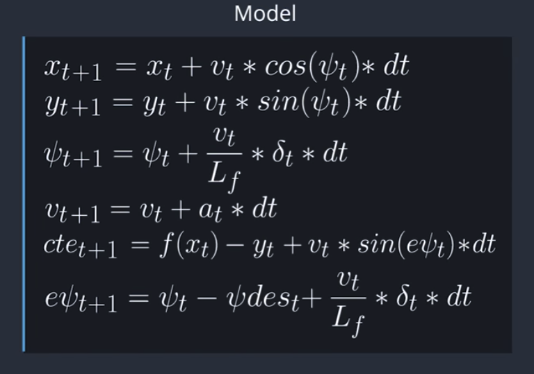

# Model Predictive Control

The goal of this project is to navigate a track in a Udacity-provided simulator, which communicates telemetry and track waypoint data via websocket, by sending steering and acceleration commands back to the simulator. The solution must be robust to 100ms latency, as one may encounter in real-world application.

This solution makes use of the IPOPT and CPPAD libraries to calculate an optimal trajectory and its associated actuation commands in order to minimize error with a third-degree polynomial fit to the given waypoints. The optimization considers only a short duration's worth of waypoints, and produces a trajectory for that duration based upon a model of the vehicle's kinematics and a cost function based mostly on the vehicle's cross-track error (roughly the distance from the track waypoints) and orientation angle error, with other cost factors included to improve performance.

---

## Dependencies

* cmake >= 3.5
 * All OSes: [click here for installation instructions](https://cmake.org/install/)
* make >= 4.1(mac, linux), 3.81(Windows)
  * Linux: make is installed by default on most Linux distros
  * Mac: [install Xcode command line tools to get make](https://developer.apple.com/xcode/features/)
  * Windows: [Click here for installation instructions](http://gnuwin32.sourceforge.net/packages/make.htm)
* gcc/g++ >= 5.4
  * Linux: gcc / g++ is installed by default on most Linux distros
  * Mac: same deal as make - [install Xcode command line tools]((https://developer.apple.com/xcode/features/)
  * Windows: recommend using [MinGW](http://www.mingw.org/)
* [uWebSockets](https://github.com/uWebSockets/uWebSockets)
  * Run either `install-mac.sh` or `install-ubuntu.sh`.
  * If you install from source, checkout to commit `e94b6e1`, i.e.
    ```
    git clone https://github.com/uWebSockets/uWebSockets
    cd uWebSockets
    git checkout e94b6e1
    ```
    Some function signatures have changed in v0.14.x. See [this PR](https://github.com/udacity/CarND-MPC-Project/pull/3) for more details.

* **Ipopt and CppAD:** Please refer to [this document](https://github.com/udacity/CarND-MPC-Project/blob/master/install_Ipopt_CppAD.md) for installation instructions.
* [Eigen](http://eigen.tuxfamily.org/index.php?title=Main_Page). This is already part of the repo so you shouldn't have to worry about it.
* Simulator. You can download these from the [releases tab](https://github.com/udacity/self-driving-car-sim/releases).
* Not a dependency but read the [DATA.md](./DATA.md) for a description of the data sent back from the simulator.


## Basic Build Instructions

1. Clone this repo.
2. Make a build directory: `mkdir build && cd build`
3. Compile: `cmake .. && make`
4. Run it: `./mpc`.

## Reflection

#### The Model:

The kinematic model includes the vehicle's x and y coordinates, orientation angle (psi), and velocity, as well as the cross-track error and psi error (epsi). Actuator outputs are acceleration and delta (steering angle). The model combines the state and actuations from the previous timestep to calculate the state for the current timestep based on the equations below:



#### Timestep Length and Elapsed Duration (N & dt): 

The values chosen for N and dt are 10 and 0.1, respectively. These values mean that the optimizer is considering a one-second duration in which to determine a corrective trajectory. Adjusting either N or dt (even by small amounts) often produced erratic behavior. Other values tried include (20 / 0.05), (8 / 0.125), (6 / 0.15), and many others.

#### Polynomial Fitting and MPC Preprocessing: 

The waypoints are preprocessed by transforming them to the vehicle's perspective. This simplifies the process to fit a polynomial to the waypoints because the vehicle's x and y coordinates are now at the origin (0, 0) and the orientation angle is also zero.

#### Model Predictive Control with Latency: 

The approach to dealing with latency was twofold (not counting simply limiting the speed): the original kinematic equations depend upon the actuations from the previous timestep, but with a delay of 100ms (which happens to be the timestep interval) the actuations are applied another timestep later, so the equations have been altered to account for this. Also, in addition to the cost functions suggested in the lessons (punishing CTE, epsi, difference between velocity and a reference velocity, delta, acceleration, change in delta, and change in acceleration) an additional cost penalizing the combination of velocity and delta was included and results in much more controlled smooth cornering.

## Sample Run

[](https://www.youtube.com/watch?v=eqQIoT9D5Oc)
